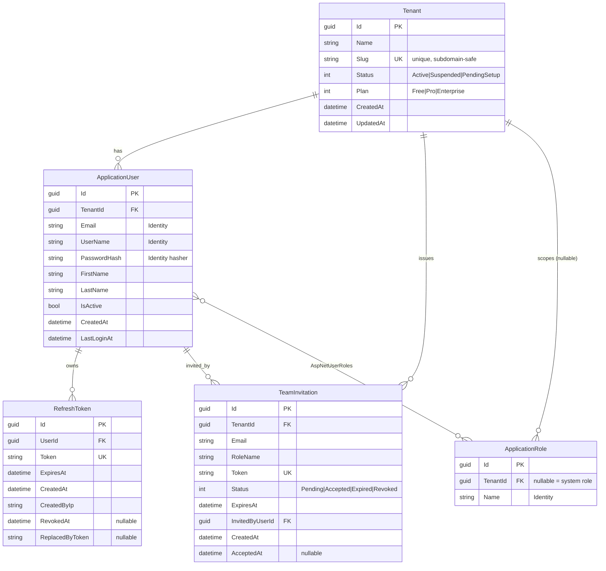

# NexaFlow — Data Model / ERD (T-002)

Multi-tenant SaaS. **كل جدول business بيحمل `TenantId`** وبيتفلتر تلقائياً بـ global query filter (شوف T-004).
الـ Identity tables بتاعة ASP.NET Core Identity مستخدمة كأساس للـ users/roles.

## ERD

## Indexes
| Table | Index | Reason |
|---|---|---|
| Tenant | `UX_Tenant_Slug` (unique) | lookup بالـ subdomain |
| ApplicationUser | `IX_User_TenantId` | فلترة per-tenant |
| ApplicationUser | `UX_User_TenantId_Email` (unique) | إيميل فريد داخل الـ tenant |
| RefreshToken | `UX_RefreshToken_Token` (unique) | lookup عند الـ refresh |
| RefreshToken | `IX_RefreshToken_UserId` | تنظيف tokens المستخدم |
| TeamInvitation | `UX_Invitation_Token` (unique) | accept link |
| TeamInvitation | `IX_Invitation_TenantId_Email` | منع دعوات مكررة |

## Roles (seeded)
| Role | Scope | Notes |
|---|---|---|
| `SuperAdmin` | System (TenantId = null) | بيدير المنصة كلها |
| `CompanyAdmin` | Tenant | أول user عند الـ onboarding |
| `Manager` | Tenant | |
| `Employee` | Tenant | افتراضي للـ invited users |

## Multi-tenant strategy
- **Shared database, shared schema** + discriminator column `TenantId`.
- العزل بيتفرض على مستوى الـ `DbContext` (global query filter) مش الـ query — مفيش query بتنسى الفلتر.
- الـ `TenantId` بييجي من الـ JWT claim → `ITenantContext` → الـ DbContext.
