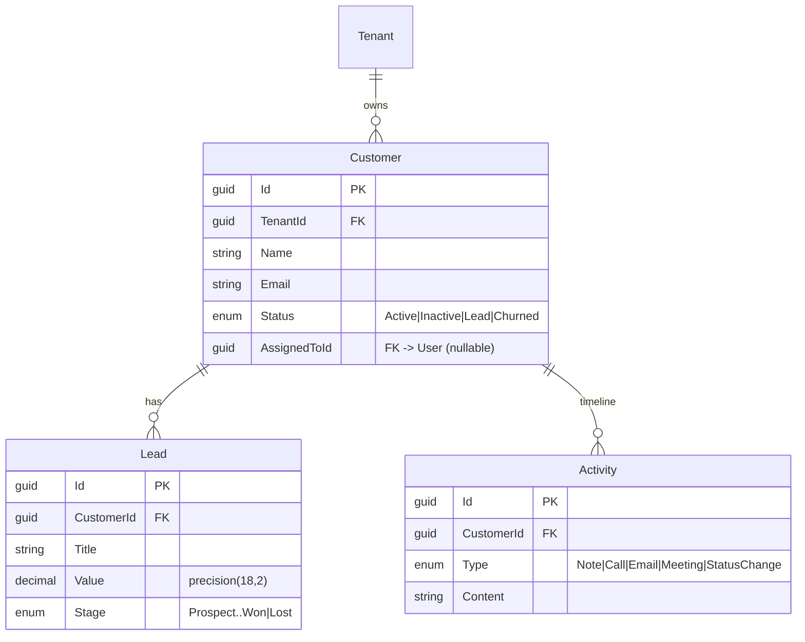
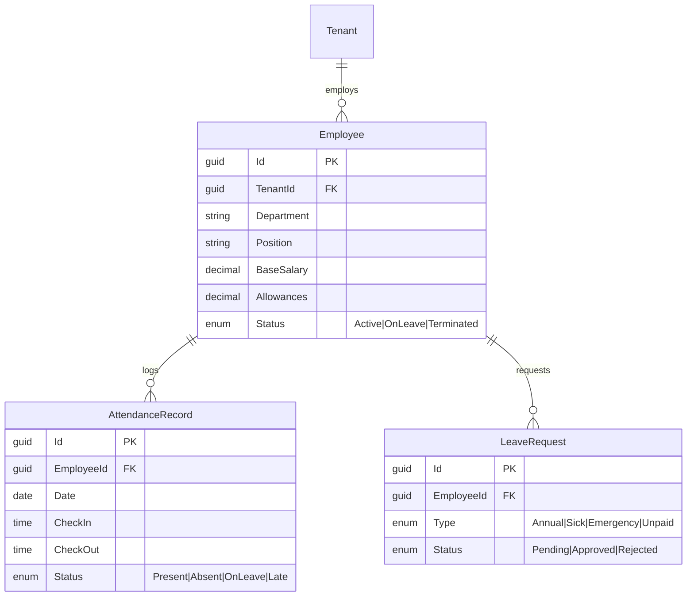
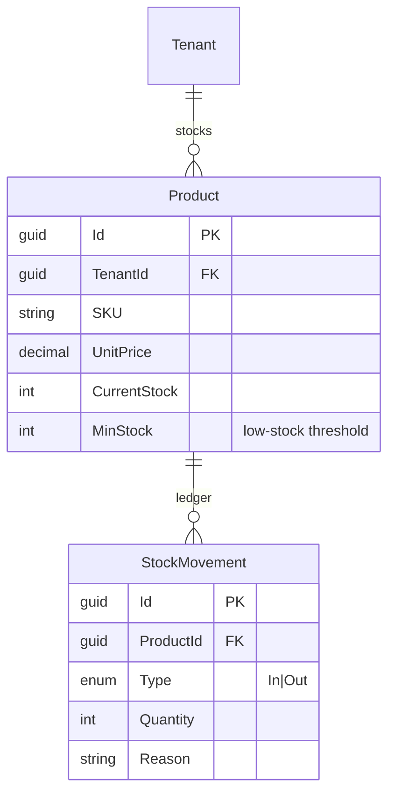

# NexaFlow — Business Modules (CRM · HR · Inventory)

Three business modules built on top of the multi-tenant core (auth, tenancy, RBAC).
Every module follows the same vertical slice and respects the Clean Architecture
dependency rule (`API → Infrastructure → Application → Core`).

> All business tables carry a `TenantId` and are filtered automatically by the
> global query filter in `AppDbContext`, so a module never has to remember to
> scope its own reads — isolation is enforced at the data layer.

Per-module slice:

```
Entity (Core) → DTO + Validator + Interface (Application) → Service (Infrastructure) → Minimal-API Endpoint (API)
```

---

## 1. CRM — Customers, Leads & Activity Timeline

Manage customers, a sales pipeline of leads, and an automatic activity timeline.

### Data model



### Key business rules
- **Auto-generated timeline:** creating a customer, creating a lead, or moving a
  lead between pipeline stages each append a system-generated `StatusChange`
  activity, so the customer history is reconstructable without manual logging.
- **Pipeline → customer sync:** moving a lead to `Won` reactivates the underlying
  customer (`CustomerStatus.Active`).
- **SQL-translatable projections:** list queries project straight to lightweight
  row records (incl. a correlated lookup for the assignee name), keeping the work
  in the database rather than loading full entities.

### Endpoints
| Method | Route | Purpose |
|---|---|---|
| GET/POST | `/customers` | list / create customers |
| GET/PUT/DELETE | `/customers/{id}` | read / update / delete |
| GET/POST | `/customers/{id}/activities` | read / append timeline entries |
| GET/POST | `/leads` | list / create leads |
| PUT | `/leads/{id}/stage` | advance pipeline stage |

---

## 2. HR — Employees, Attendance, Leaves & Payroll

### Data model



### Key business rules
- **Late detection:** check-in after `09:00` is recorded as `Late`; a second
  check-in on the same day is rejected with a `409 Conflict`.
- **Leave approval workflow:** requests move `Pending → Approved/Rejected` with a
  reviewer note.
- **Payroll calculation:** net salary is derived from real attendance.
  Working days exclude Fridays (Egyptian weekend); a daily rate
  (`BaseSalary / workingDays`) is deducted for each absent day:

  ```
  gross    = BaseSalary + Allowances
  dailyRate= BaseSalary / workingDays
  deduction= dailyRate * absentDays
  net      = gross - deduction
  ```
- **Payslip PDF:** rendered with QuestPDF (Community licence).

### Endpoints
| Method | Route | Purpose |
|---|---|---|
| GET/POST | `/employees` | list / create |
| GET/PUT/DELETE | `/employees/{id}` | read / update / delete |
| POST | `/attendance/check-in` · `/attendance/{id}/check-out` | clock in/out |
| GET | `/attendance/summary?date=` | daily present/absent/late/leave counts |
| GET/POST | `/leaves` | list / request |
| PUT | `/leaves/{id}/review` | approve or reject |
| GET | `/payroll/{employeeId}?year=&month=` | calculate payslip |

---

## 3. Inventory — Products & Stock Movements

### Data model



### Key business rules
- **Movement ledger:** every stock change is recorded as an `In`/`Out` movement
  and the product's `CurrentStock` is recalculated from it.
- **Oversell guard:** an `Out` movement larger than the available stock is
  rejected rather than producing a negative balance.
- **Low-stock reporting:** products at or below their `MinStock` threshold are
  surfaced for reordering.

### Endpoints
| Method | Route | Purpose |
|---|---|---|
| GET/POST | `/products` | list / create |
| GET/PUT/DELETE | `/products/{id}` | read / update / delete |
| POST | `/products/{id}/movements` | record stock in/out |
| GET | `/products/{id}/movements` | movement history |
| GET | `/products/low-stock` | items needing reorder |

---

## Cross-cutting concerns (shared by all modules)
- **Multi-tenancy:** `TenantResolutionMiddleware` reads the `tenant_id` JWT claim
  into a scoped `ITenantContext`; `AppDbContext` global query filters scope every
  read automatically.
- **Validation:** FluentValidation validators per create/update DTO.
- **Error handling:** domain exceptions (`NotFoundException`, `ConflictException`,
  `UnauthorizedAppException`) mapped to the right HTTP status codes.
- **Persistence:** EF Core 10 + SQL Server, code-first migrations, audit
  timestamps applied centrally in `SaveChanges`.
